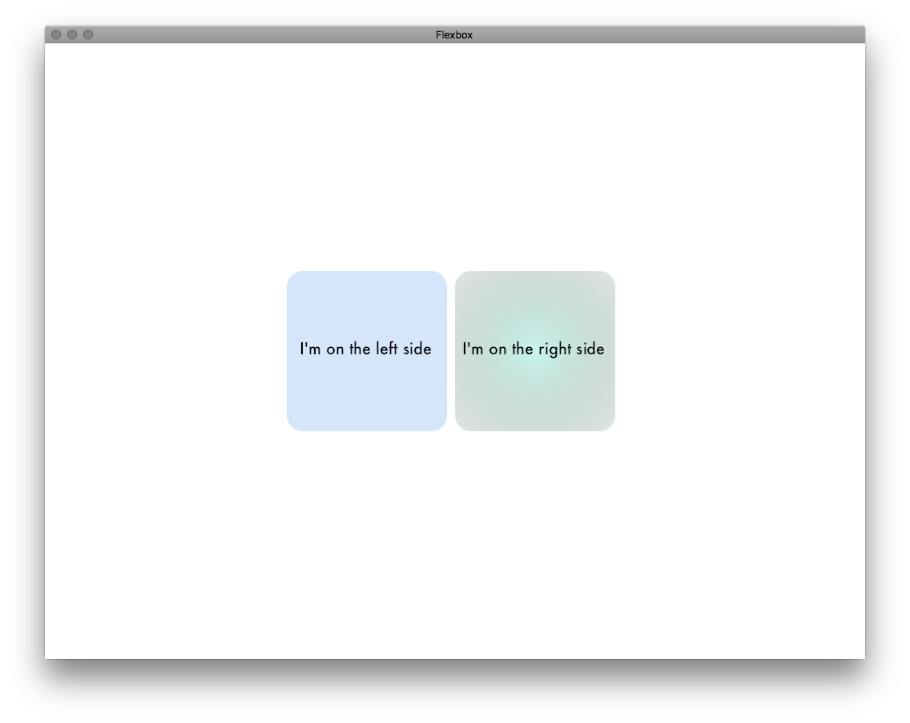

# Flexbox for Ogre3D 2.1
This library will bring you a foundation to build a flexbox based GUI. Rendered with Ogre 2.1. The library:
* Uses [Yoga](https://yogalayout.com/) to calculate layouts using CSS's [flexbox concept](https://css-tricks.com/snippets/css/a-guide-to-flexbox/)
* Draws boxes with [Cairo graphics](https://www.cairographics.org/) and SDL2
* Draws text with [Pango](https://www.pango.org/)
* Displays everything by converting the painted surfaces to Ogre textures and renders them on plane a mesh (with identity projection matrix) and displaces them using SceneNodes



## Building
The lack of my CMake skills puts a "CMake configuration" on my TODO. Until then, you could either use [WAF](https://waf.io) or you could build it manually. This is what you need to compile and link:

### Compile
* `flexbox/*.cpp`
* [Clone the Yoga repo](https://github.com/facebook/yoga) and compile yoga/yoga/*.cpp

The library uses C++14 features and standard library. If you use clang, you need to set the compile flags `-std=c++14` and `-stdlib=libc++`.

### Linking
Link against
* OgreMain & OgreHlmsUnlit
* SDL2
* pango 1.40.x
* cairo 1.14
* and pangocairo

The library has only been visually tested on macOS Sierra 10.12, but I've built & run automated tests on Linux (clang) ([see .travis.yml](./.travis.yml)).


## Basic usage
As for now, I have not commited any demo source code. Instead, this introduction have to serve as a demo until there is a proper demo app available.
```c++
#include "flexbox_node.h"
...
Ogre::SceneManager *ogre_scene_mgr = ...;
```

```c++
// Create the layout tree hierarchy
using namespace flexbox;
flexbox_node root(ogre_scene_mgr);
```

`flexbox_nodes` will create SceneNodes, MovableObjects, Datablocks etc., when necessary, and destroy them automatically using smart pointers. Lets create the style for the two boxes shown in the picture above:

```c++
flexbox_stylesheet sheet;
sheet.font_family     = "Futura";
sheet.font_size       = 20;
sheet.color           = Ogre::ColourValue(0.0, 0.0, 0.0, 1.0);

// Make them square and round the corners
sheet.width           = pixels(200);
sheet.height          = pixels(200);
sheet.border_radius   = percent(20);

// Have some space between the squares
sheet.margin_right    = 10;

// Center the text within the square both vertically and horizontally
sheet.justify_content = YGJustifyCenter;
sheet.align_items     = YGAlignCenter;
```

Now, lets create the "canvases" for the two boxes and attach them under the root. Canvases holds the structures for the drawing library.
```c++
typedef std::shared_ptr<flexbox_canvas>       canvas_ptr;
typedef std::shared_ptr<flexbox_canvas_text>  canvas_text_ptr;
typedef std::shared_ptr<flexbox_node>         node_ptr;

node_ptr square1 = root.create_child(canvas_ptr::make_shared(), sheet);
node_ptr square2 = root.create_child(canvas_ptr::make_shared(), sheet);

square1->create_child(canvas_text_ptr::make_shared("I'm on the left side"));
square2->create_child(canvas_text_ptr::make_shared("I'm on the right side"));

// Make the squares have different background colors. And make the right one have a gradient background.
// All `flexbox_nodes` have their own stylesheet and canvas available.
square1->stylesheet.background_color     = Ogre::ColourValue(0.6627450980392157, 0.7843137254901961, 0.9568627450980393, 1.0);
square2->stylesheet.gradient_color_start = Ogre::ColourValue(0.5764705882352941, 0.9098039215686274, 0.8274509803921568, 1.0);
square2->stylesheet.gradient_radial      = true;
```

Center the two squares horizontally and vertically relative to the window
```c++
root.stylesheet.justify_content = YGJustifyCenter;
root.stylesheet.align_items     = YGAlignCenter;
```

Lastly, let the root node calculate the layout, paint the boxes, create the textures, position the SceneNodes etc.
```c++
const int window_width  = 1024;
const int window_height = 768;
root.layout_and_paint(window_width, window_height);

[...]

while(...) {
  ogre.renderOneFrame();
  if (window_resized()) {
    root.layout_and_paint(window_width, window_height);
  }
}
```
You can find this snippet in [docs/demo.cpp](./docs/demo.cpp)